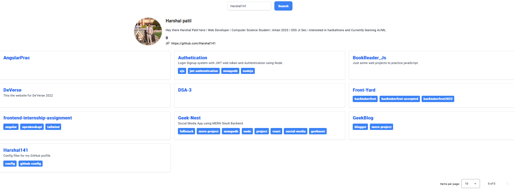

### Deployed on Netlify: https://prismatic-trifle-6c0a3b.netlify.app/

### Testing - 
 seearch Harshal141 in search, use pagination to see the repository

 

 

### Install requirements
* Install angular cli [Ref](https://angular.io/cli)
* `npm install` in this repository 

## Development server

Run `ng serve` for a dev server. Navigate to http://localhost:4200/. The app will automatically reload if you change any of the source files.

## Further help

Visit the [Angular Documentation](https://angular.io/guide/styleguide) to learn more.
Styling is to be strictly done with [Tailwind](https://tailwindcss.com/docs/installation).